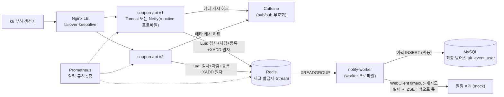

# coupon-system — 선착순 쿠폰 발급 시스템

순간 폭주 트래픽(목표 5,000+ RPS)을 **초과 발급 0건**으로 처리하는 선착순 쿠폰 시스템.
"측정 → 병목 발견 → 개선 → 재측정" 사이클을 수치로 기록하는 것이 목표다.

- 전체 설계·로드맵: [docs/coupon-system-roadmap.md](docs/coupon-system-roadmap.md)
- 실험 리포트 9편: [docs/reports/](docs/reports/) · 포스트모템 4편: [docs/postmortems/](docs/postmortems/) · 회고 6편: [docs/retrospectives/](docs/retrospectives/)

## 아키텍처 (현재형)



## 목표 대비 달성 (실측)

| 목표 (로드맵 2.2) | 달성 | 근거 |
|---|---|---|
| 발급 p99 ≤ 200ms | ✅ 정상 부하에서 p95 3~4ms (500rps chaos 중에도 4ms) | [3전략 비교](docs/reports/phase2-strategy-comparison.md)·[리허설](docs/reports/phase5-local-rehearsal.md) |
| 초과 발급 0건 | ✅ 전 실험 0건 (스파이크 76만 요청 포함) + CI 동시성 테스트 상시 검증 | 각 리포트 정합성 절 |
| 중복 발급 0건 | ✅ Lua SISMEMBER + DB 유니크 제약 이중 방어, 전 실험 0건 | 동상 |
| 인스턴스 1대 강제 종료 시 성공률 99.9% | ✅ **99.990%** (2회 교체 포함) | [chaos 리허설](docs/reports/phase5-local-rehearsal.md) |
| 알림 at-least-once | ✅ Stream 소비 + 백오프 재시도 큐 + pending 회수 | Phase 3b·5 |
| 처리량 5,000rps | ⏳ 단일 머신(k6 공존)에선 TCP 수용 한계로 미달 — 부하 생성기 분리(실배포)에서 재측정 | [baseline](docs/reports/phase1-baseline.md)·[Tomcat vs Netty](docs/reports/phase3-tomcat-vs-netty.md) |
- Phase 회고 (블로그 포스팅용): [docs/retrospectives/](docs/retrospectives/)

## 스택

Java 21 · Spring Boot 3.5 (MVC → WebFlux 전환 예정) · MySQL 8 · Redis 7 · k6 · Prometheus/Grafana

## 빠른 시작

```powershell
docker compose -f docker/docker-compose.yml up -d
.\gradlew.bat bootRun
Get-Content scripts\seed-event.sql -Raw | docker exec -i coupon-mysql mysql -ucoupon -pcoupon coupon
k6 run k6/scenarios/smoke.js
.\scripts\run-loadtest.ps1 -Scenario issue-spike   # 부하 + 정합성 검증
```

Grafana: http://localhost:3000 · Prometheus: http://localhost:9090

## 진행 상태

| Phase | 내용 | 상태 |
|---|---|---|
| 0 | 기반 공사 (인프라, CI, AI 하네스) | ✅ [회고](docs/retrospectives/phase-0-기반공사.md) |
| 1 | 정직한 MVP — 비관적 락 baseline, HikariCP/explain 실험 | ✅ [회고](docs/retrospectives/phase-1-정직한-mvp.md) |
| 2 | Redis 재고 차감 3전략 비교 | ✅ [회고](docs/retrospectives/phase-2-redis-3전략.md) |
| 3 | 비동기 알림 + WebFlux/Netty 전환 | ✅ [회고](docs/retrospectives/phase-3-비동기와-netty.md) |
| 4 | JVM/GC 튜닝, 장애 훈련(tcpdump) | ✅ [회고](docs/retrospectives/phase-4-저수준-튜닝.md) |
| 5 | 실배포·고가용성 운영 | 🔄 [로컬 리허설 완료](docs/reports/phase5-local-rehearsal.md) (chaos 99.990%), 실배포 남음 |
| 6 | AI 하네스 체계화 (MCP, skills, hooks) | ✅ [회고](docs/retrospectives/phase-6-ai-하네스.md) |
