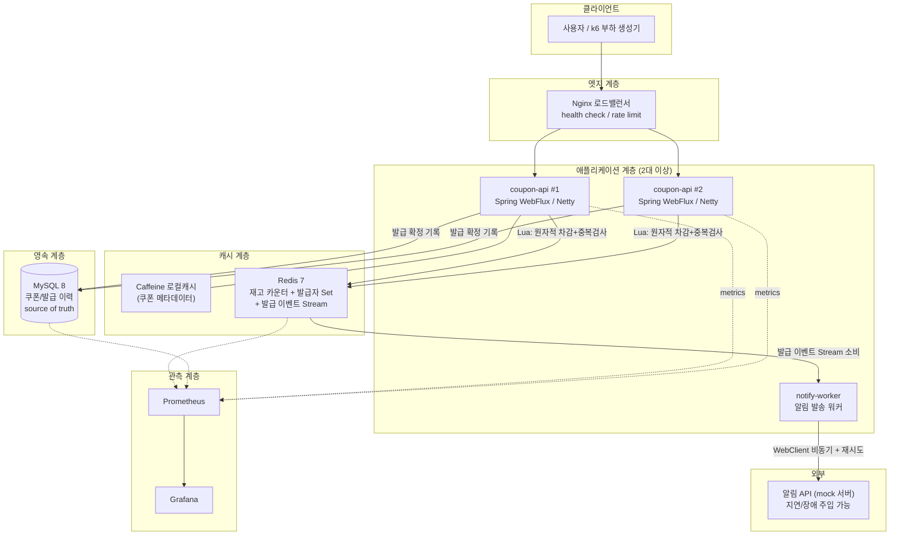
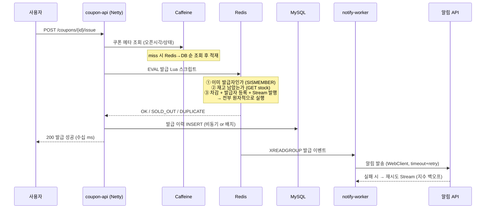

# 선착순 쿠폰/재고 시스템 — 아키텍처 설계서 & 구축 로드맵

> **목표 한 줄 요약**: "순간 최대 수만 RPS의 선착순 쿠폰 발급 트래픽을 초과 발급 0건으로 처리하고, 그 과정에서 측정 → 병목 발견 → 개선 → 재측정의 사이클을 수치로 기록한 운영 경험"을 만든다.
>
> 스택: Java 21 + Spring Boot 3.x (MVC/Tomcat → WebFlux/Netty 전환 스토리) · MySQL 8 · Redis 7 · k6 · Prometheus/Grafana · Claude Code(AI 하네스)

---

## 1. 왜 이 프로젝트인가 (구직 관점)

토이 프로젝트가 이력서에서 힘을 잃는 이유는 대부분 "만들었다"에서 끝나기 때문입니다. 이 프로젝트는 처음부터 **"운영하면서 개선했다"**를 목표로 설계합니다. 선착순 쿠폰/재고 도메인은 나열하신 역량이 억지스럽지 않게 전부 등장하는 거의 유일한 단일 도메인입니다. 순간 폭주 트래픽이 있어야 Redis와 대기열이 필요해지고, 재고라는 정합성 제약이 있어야 분산 환경의 동시성 제어가 필요해지고, 발급 완료 알림 같은 외부 호출이 있어야 비동기 처리가 필요해집니다.

면접에서 통하는 문장은 "Redis를 썼습니다"가 아니라 **"k6 open model 테스트에서 p99가 4.2초까지 튀는 걸 확인했고, 원인이 HikariCP 풀 고갈이라는 걸 tcpdump로 확인한 뒤 재고 차감을 Redis Lua로 옮겨 p99를 180ms로 줄였습니다"** 입니다. 이 문서의 모든 단계는 이런 문장을 만들 수 있도록 "측정값이 남는" 구조로 짜여 있습니다.

## 2. 서비스 정의

### 2.1 기능 요구사항

핵심 기능은 의도적으로 작게 유지합니다. 기능이 많으면 운영·튜닝에 쓸 시간을 뺏깁니다.

| 기능 | 설명 | 존재 이유 (역량 연결) |
|---|---|---|
| 쿠폰 이벤트 생성/조회 | 관리자용. 이벤트명, 총 수량, 오픈 시각 | 조회 폭주 → 로컬캐시(Caffeine) |
| 선착순 쿠폰 발급 | 오픈 시각에 트래픽 폭주. 1인 1매, 총량 제한 | Redis 원자 연산, 동시성 제어, 정합성 |
| 발급 내역 조회 | 사용자별 발급 이력 | MySQL 인덱스 설계, explain 튜닝 |
| 발급 완료 알림 | 외부 알림 API 호출 (mock 서버 직접 구축) | 동기 → 비동기 전환 스토리, WebClient |
| 재고 현황 집계 | 남은 수량 실시간 노출 | 캐시 계층화, 정합성 vs 성능 트레이드오프 |

### 2.2 비기능 요구사항 (수치 목표)

목표 수치를 먼저 박아두는 것이 중요합니다. 나중에 "목표 대비 어디까지 갔는지"가 그대로 포트폴리오가 됩니다.

| 항목 | 목표 | 측정 방법 |
|---|---|---|
| 발급 API 처리량 | 로컬 기준 5,000 RPS 이상, 최종 10,000 RPS | k6 constant-arrival-rate |
| 발급 API p99 지연 | 200ms 이하 (폭주 구간 포함) | k6 + Grafana |
| 초과 발급 | **0건** (테스트 종료 후 DB count로 검증) | 테스트 후 정합성 검증 쿼리 |
| 중복 발급 | 0건 (1인 1매) | 유니크 제약 + 검증 쿼리 |
| 가용성 | 인스턴스 1대 강제 종료 시에도 발급 성공률 99.9% 유지 | 장애 주입 중 k6 실행 |
| 알림 발송 | 발급 성공 후 5초 내 최종 발송 (at-least-once) | 재시도 큐 지표 |

## 3. 역량 매핑표 — "이 항목은 어느 단계에서 증명되는가"

나열하신 역량을 로드맵 Phase에 매핑한 표입니다. 각 항목이 어떤 구체적 작업으로 증명되는지, 면접/이력서에서 어떤 문장이 되는지까지 적었습니다.

| 역량 | Phase | 구체적 작업 | 만들어지는 스토리 |
|---|---|---|---|
| MySQL explain 쿼리 개선 | 1 | 발급 이력 조회를 일부러 풀스캔으로 시작 → explain으로 인덱스 설계, 커버링 인덱스 | before/after 실행계획 + 응답시간 그래프 |
| 로컬캐시 성능 개선 | 2 | 쿠폰 메타데이터 Caffeine 캐시 + TTL/무효화 전략 | 조회 API DB 부하 95% 감소 수치 |
| Redis 성능·정합성 | 2 | Lua 스크립트 원자적 차감, 발급자 Set, DB 동기화 | 초과 발급 0건을 부하테스트로 증명 |
| 비동기 외부호출 | 3 | 알림 API 동기 호출로 시작 → 장애 전파 체험 → WebClient + 재시도 큐 | 외부 API 3초 지연 주입 시에도 발급 p99 유지 |
| tcpdump 패킷 분석 | 4 | 풀 고갈, TIME_WAIT 폭증 등 장애를 직접 주입하고 패킷으로 원인 규명 | 장애 회고(포스트모템) 문서 3~4건 |
| connection pool 등 설정 | 1, 3 | HikariCP → R2DBC pool, Redis Lettuce pool, Tomcat/Netty 설정 전부 근거 있는 수치로 | "기본값 vs 튜닝값" 비교 실험 기록 |
| k6 성능테스트 | 전 구간 | 모든 Phase의 시작과 끝은 k6. closed/open model 구분 사용 | Phase별 성능 변화 추이 그래프 |
| thread 수치, Netty | 3 | Tomcat 스레드풀 한계 측정 → WebFlux/Netty 전환 → 동일 부하 재측정 | "왜 Netty인가"를 남의 글이 아닌 내 수치로 답변 |
| JVM/GC 튜닝 | 4 | GC 로그 분석, G1 vs ZGC, heap/ratio 실험 | STW로 인한 p99 스파이크 제거 스토리 |
| Claude로 token/context 절약 | 0, 6 | CLAUDE.md 설계, 서브에이전트 분리, 컨텍스트 전략 | AI 활용 생산성 스토리 |
| MCP 서버 프로젝트 적용 | 6 | MySQL explain MCP, Grafana/k6 결과 조회 MCP 직접 제작 | "AI가 내 운영 데이터를 읽게 만든" 경험 |
| skills 나만의 하네스 | 6 | 성능테스트 실행→결과 요약 skill, 포스트모템 작성 skill | 반복 워크플로 자동화 |
| hooks 권한 가드 | 6 | 운영 DB 접근/위험 명령 차단 hook | AI 안전장치 설계 경험 |
| 전방위 테스트 자동화 | 5, 6 | 단위/통합(Testcontainers)/성능 회귀 테스트 CI 통합 | PR마다 성능 회귀 감지 파이프라인 |

---

## 4. 시스템 아키텍처

### 4.1 최종 형태 (Phase 5 완성 시점)



### 4.2 발급 요청 흐름 (핵심 시퀀스)



이 구조의 핵심 결정은 **"사용자 응답의 임계 경로(critical path)에서 MySQL과 외부 API를 밀어낸다"**는 것입니다. 응답에 필요한 것은 Redis의 원자적 판정뿐이고, DB 기록과 알림은 뒤따라옵니다. 이 결정 하나에서 정합성 질문(Redis-DB가 어긋나면? 워커가 죽으면?)이 파생되는데, 그 질문들에 대한 답이 곧 면접 단골 질문의 답이 됩니다.

### 4.3 데이터 모델 (MySQL — source of truth)

```sql
CREATE TABLE coupon_event (
    id            BIGINT PRIMARY KEY AUTO_INCREMENT,
    name          VARCHAR(100) NOT NULL,
    total_qty     INT NOT NULL,
    issued_qty    INT NOT NULL DEFAULT 0,      -- 집계용, Redis가 진실
    open_at       DATETIME(3) NOT NULL,
    close_at      DATETIME(3) NOT NULL,
    status        VARCHAR(20) NOT NULL,        -- READY / OPEN / CLOSED
    created_at    DATETIME(3) NOT NULL DEFAULT CURRENT_TIMESTAMP(3)
);

CREATE TABLE coupon_issue (
    id            BIGINT PRIMARY KEY AUTO_INCREMENT,
    event_id      BIGINT NOT NULL,
    user_id       BIGINT NOT NULL,
    issued_at     DATETIME(3) NOT NULL DEFAULT CURRENT_TIMESTAMP(3),
    notify_status VARCHAR(20) NOT NULL DEFAULT 'PENDING',
    UNIQUE KEY uk_event_user (event_id, user_id)   -- 중복 발급의 최종 방어선
    -- 조회용 인덱스는 Phase 1에서 explain 보며 직접 설계 (일부러 처음엔 없이 시작)
);
```

`uk_event_user` 유니크 제약이 중요합니다. Redis가 1차 방어선이지만, 장애·버그로 뚫려도 DB가 막아주는 **이중 방어(defense in depth)** 구조이고, 이것 자체가 정합성 설계 스토리입니다.

### 4.4 Redis 정합성 전략 (가장 자주 물어보는 부분)

재고 차감의 후보 전략 세 가지를 **직접 다 구현해서 벤치마크로 비교**하는 것을 권합니다. 비교 실험 자체가 최고의 포트폴리오 콘텐츠입니다.

| 전략 | 방식 | 장점 | 단점 |
|---|---|---|---|
| ① MySQL 비관적 락 | `SELECT ... FOR UPDATE` | 구현 단순, 정합성 확실 | 락 경합으로 처리량 급락 — baseline 역할 |
| ② Redis 분산락 (Redisson) | 락 획득 후 차감 | 범용적 | 락 자체가 병목, 락 만료/해제 엣지케이스 |
| ③ Redis Lua 원자 스크립트 | 검사+차감+등록을 단일 스크립트로 | 락 없이 원자성, 최고 처리량 | Redis 장애 시 시나리오 설계 필요 → **최종 채택** |

채택안(③)의 Lua 스크립트 뼈대:

```lua
-- KEYS[1]=stock:{eventId}, KEYS[2]=issued:{eventId}, KEYS[3]=stream:issue
-- ARGV[1]=userId
if redis.call('SISMEMBER', KEYS[2], ARGV[1]) == 1 then
    return 'DUPLICATE'
end
local stock = tonumber(redis.call('GET', KEYS[1]))
if stock == nil or stock <= 0 then
    return 'SOLD_OUT'
end
redis.call('DECR', KEYS[1])
redis.call('SADD', KEYS[2], ARGV[1])
redis.call('XADD', KEYS[3], '*', 'eventId', KEYS[1], 'userId', ARGV[1])
return 'OK'
```

Redis↔MySQL 정합성은 세 겹으로 지킵니다. 첫째, 발급 이벤트를 Redis Stream(consumer group)으로 발행해 DB 기록 워커가 at-least-once로 소비합니다. 둘째, DB의 유니크 제약이 중복을 최종 차단하므로 at-least-once의 중복 소비가 무해해집니다(멱등성). 셋째, 주기적 리컨실리에이션 배치가 Redis 발급자 Set과 DB 이력 수를 대사(對査)하고 어긋나면 알림을 띄웁니다. "캐시와 DB가 어긋나면 어떻게 하나요?"라는 질문에 3중 구조로 답할 수 있게 됩니다.

### 4.5 캐시 계층화

읽기 경로는 Caffeine(로컬, ~1ms 미만) → Redis(~1ms) → MySQL 순의 3계층입니다. 쿠폰 메타데이터(이벤트명, 오픈시각, 상태)는 변경이 드물어 로컬캐시 적중률이 99%+ 나오는 반면, **잔여 수량은 절대 로컬캐시에 넣지 않습니다** — 인스턴스마다 다른 값이 보이는 문제를 직접 시연하고, 왜 데이터 성격에 따라 캐시 계층을 다르게 태우는지를 스토리로 만드세요. 로컬캐시 무효화는 오픈/마감 상태 전환 시 Redis pub/sub으로 전 인스턴스에 브로드캐스트하는 패턴을 씁니다(다중 인스턴스 로컬캐시의 고전적 난제를 정면으로 다루는 부분).

---

## 5. 구축 로드맵 (총 12~14주 기준, 주당 10~15시간 가정)

각 Phase는 반드시 **k6 측정으로 시작해서 k6 측정으로 끝냅니다.** "개선 전 수치 → 변경 → 개선 후 수치"가 없는 작업은 이력서에서 힘이 없습니다. Phase마다 마지막에 짧은 회고 글(블로그)을 남기는 것까지가 한 사이클입니다.

### Phase 0 — 기반 공사 (1주)

레포지토리, docker-compose(MySQL/Redis/Prometheus/Grafana/mock 알림 서버), GitHub Actions CI, 그리고 **CLAUDE.md**를 만듭니다. CLAUDE.md에는 아키텍처 요약, 코딩 컨벤션, 자주 쓰는 명령을 압축해 넣어 매 세션 반복 설명으로 낭비되는 토큰을 줄입니다 — "claude를 이용한 token/context 절약"은 프로젝트 첫날부터 시작되는 역량입니다. mock 알림 서버는 응답 지연·에러율을 쿼리 파라미터로 주입할 수 있게 만들어 두면 Phase 3~4의 장애 실험 도구가 됩니다.

### Phase 1 — 정직한 MVP: Spring MVC + MySQL (2주)

의도적으로 소박하게 시작합니다. 발급 로직은 `SELECT ... FOR UPDATE`, 조회는 인덱스 없이. 그리고 k6로 첫 부하를 겁니다. 여기서 나오는 **처참한 baseline 수치가 이 프로젝트 전체 스토리의 출발점**입니다. 이 Phase에서 증명되는 역량: explain으로 발급 이력 조회 개선(풀스캔 → 커버링 인덱스, 실행계획 캡처 필수), HikariCP 설정 실험(pool size를 5/20/100으로 바꿔가며 처리량·타임아웃 곡선 기록 — "pool은 클수록 좋은 게 아니다"를 수치로), Tomcat `max-threads` 한계 관측. 종료 조건: baseline 성능 리포트 1편.

### Phase 2 — Redis와 정합성 (2~3주)

4.4의 전략 ①→②→③을 순서대로 구현하고 동일 k6 시나리오로 3자 비교합니다. Caffeine 로컬캐시를 조회 경로에 넣고 DB 쿼리 수 감소를 Grafana로 확인합니다. 부하테스트 종료 후 "초과 발급 0건, 중복 0건" 검증 쿼리를 CI에 넣어 **정합성을 자동 테스트로 증명**합니다. 종료 조건: 3개 전략 비교 리포트(처리량/p99/정합성), 정합성 검증 자동화.

### Phase 3 — 비동기와 Netty 전환 (2~3주)

먼저 알림을 동기 호출로 넣고 mock 서버에 3초 지연을 주입해 **발급 API 전체가 함께 무너지는 장애를 재현**합니다(스레드풀 고갈 → 응답 지연 전파). 이것을 tcpdump/스레드덤프로 관찰한 뒤 Redis Stream + 워커 + WebClient 비동기 구조로 분리하고, 같은 지연 주입에서 발급 p99가 흔들리지 않음을 보입니다. 이어서 MVC(Tomcat) 애플리케이션을 WebFlux(Netty) + R2DBC로 전환하고 동일 부하로 재측정합니다. Tomcat 스레드 200개가 모두 대기 상태로 잠기는 그래프와, Netty 이벤트 루프(코어 수만큼)가 같은 부하를 소화하는 그래프를 나란히 두는 것이 "왜 Netty인가"의 대답입니다. 주의: R2DBC 생태계 제약(배치, 복잡한 매핑)도 겪게 되는데, 그 불편함까지 기록해야 균형 잡힌 스토리가 됩니다. 종료 조건: 동기 vs 비동기, Tomcat vs Netty 비교 리포트.

### Phase 4 — 저수준 튜닝: JVM, 패킷, 커널 (2주)

GC 로그(`-Xlog:gc*`)를 켜고 부하 중 STW가 p99에 만드는 스파이크를 찾습니다. heap 고정(-Xms=-Xmx), G1 `MaxGCPauseMillis`, ZGC 전환, (학습용으로) NewRatio/SurvivorRatio 실험을 각각 부하테스트로 비교합니다. 이어서 계획된 장애 훈련(9장)을 수행합니다 — 각 장애를 일부러 만들고, tcpdump로 패킷을 잡아 원인을 규명하고, 포스트모템을 씁니다. 종료 조건: GC 튜닝 리포트 1편 + 포스트모템 3~4편.

### Phase 5 — 실배포와 고가용성 운영 (2주)

7장에서 선택한 환경에 배포합니다. Nginx 뒤에 앱 2대, graceful shutdown, health check 기반 무중단 배포(blue-green 또는 rolling), Redis replica, 부하 중 인스턴스 1대 강제 종료(chaos 실험)를 하고 성공률을 측정합니다. Prometheus 알림 규칙(p99, 에러율, pool 사용률)을 걸어 "모니터링을 받아본" 경험을 만듭니다. Testcontainers 기반 통합 테스트와 **성능 회귀 테스트**(PR마다 k6 스모크를 돌려 p99가 임계 초과 시 실패)를 CI에 통합합니다. 종료 조건: 무중단 배포 시연 기록, chaos 실험 리포트.

### Phase 6 — AI 하네스 구축 (병행 + 마무리 1~2주)

이 Phase는 사실 Phase 0부터 병행되지만, 마지막에 체계화합니다.

| 항목 | 구현 |
|---|---|
| token/context 절약 | CLAUDE.md 계층화(루트/모듈별), 탐색·구현·리뷰용 서브에이전트 분리, 긴 로그는 파일로 저장 후 경로만 전달하는 습관 |
| MCP 서버 | ① `mysql-explain-mcp`: 쿼리를 주면 실행계획+인덱스 제안을 반환 ② `perf-mcp`: k6 결과 JSON과 Grafana 스냅샷을 조회 — AI가 "성능이 왜 떨어졌지?"에 직접 데이터를 보게 함. 직접 제작(TypeScript/Python MCP SDK) |
| skills | `/loadtest` (시나리오 실행→결과 요약→이전 결과와 비교), `/postmortem` (장애 타임라인 템플릿 작성), `/explain-check` (변경된 쿼리 자동 실행계획 검사) |
| hooks | PreToolUse 훅으로 ① 운영 DB 커넥션 문자열 포함 명령 차단 ② `rm -rf`, `DROP` 류 차단 ③ main 브랜치 직접 push 차단 — "AI에게 권한 가드를 설계했다"는 스토리 |
| 테스트 자동화 | 단위 + Testcontainers 통합 + k6 성능 회귀 + 정합성 검증 쿼리를 모두 CI 게이트로. AI가 PR을 만들면 이 게이트가 검증하는 구조 |

---

## 6. 성능 테스트 계획 (k6)

### 6.1 시나리오 설계

closed model(VU 고정)만 쓰면 서버가 느려질 때 부하도 같이 줄어 병목이 가려집니다. 선착순 테스트의 본질은 **서버 상태와 무관하게 초당 N명이 들이닥치는 것**이므로 open model(`constant-arrival-rate`)이 주력입니다.

```javascript
// scenarios/issue-spike.js — 오픈 순간 폭주 재현
export const options = {
  scenarios: {
    spike: {
      executor: 'ramping-arrival-rate',
      startRate: 100, timeUnit: '1s',
      preAllocatedVUs: 2000, maxVUs: 10000,
      stages: [
        { target: 100,  duration: '30s' },  // 평시
        { target: 5000, duration: '10s' },  // 오픈 폭주
        { target: 5000, duration: '2m'  },  // 유지
        { target: 100,  duration: '1m'  },  // 회복 관찰
      ],
    },
  },
  thresholds: {
    http_req_duration: ['p(99)<200'],
    http_req_failed: ['rate<0.001'],
  },
};
```

여기에 정합성 검증을 결합한 것이 이 프로젝트의 시그니처입니다: 재고 10,000개 이벤트에 30,000명 유니크 사용자를 밀어 넣고, 테스트 종료 후 `SELECT COUNT(*) FROM coupon_issue WHERE event_id=?`가 정확히 10,000인지, 중복이 0인지 확인하는 스크립트까지가 한 세트입니다.

### 6.2 기록 템플릿

모든 실험은 동일 양식으로 기록합니다: 가설 → 환경(커밋 해시, 인스턴스 사양, 설정값) → 시나리오 → 결과(RPS, p50/p95/p99, 에러율, CPU/메모리/GC) → 분석 → 다음 액션. 이 기록 묶음이 곧 기술 블로그 연재이자 면접 자료집이 됩니다.


---

## 7. 배포 환경 옵션 비교 — 성능테스트/성능개선 경험 관점

먼저 전제 하나: **부하 생성기(k6)와 측정 대상 서버(SUT)가 같은 머신에 있으면 수치의 신뢰도가 크게 떨어집니다.** k6 자체가 CPU를 많이 먹기 때문에, 고부하 구간에서 "서버가 느린 것"과 "부하 생성기가 힘든 것"이 섞입니다. 어떤 환경을 고르든 이 분리 여부가 수치 품질을 좌우합니다.

### 옵션 A. 로컬 docker-compose

비용이 0원이고 실험 반복 속도가 압도적으로 빠릅니다. 설정을 바꾸고 10초 만에 재시작해서 다시 부하를 걸 수 있어, HikariCP 풀 크기 실험처럼 수십 번 반복하는 실험은 로컬이 최적입니다. GC 튜닝, explain 튜닝, 전략 비교(4.4)도 상대 비교이므로 로컬 수치로 충분히 의미가 있습니다. 약점은 세 가지입니다. 부하 생성기와 SUT가 자원을 공유해 절대 수치의 신뢰도가 낮고(코어 피닝이나 별도 노트북에서 k6를 쏘는 식으로 완화 가능), 실제 네트워크 홉이 없어 keep-alive·TIME_WAIT·대역폭 같은 네트워크 계층 문제가 잘 재현되지 않으며, "실배포 운영 경험"이라는 이력서 문장을 만들 수 없습니다.

### 옵션 B. 집 서버 / 미니PC (+ Cloudflare Tunnel)

미니PC 1대(중고 10~20만원, 이미 있다면 0원)에 배포하고 노트북에서 유선 LAN으로 부하를 쏘면, **부하 생성기와 SUT가 물리적으로 분리된 실제 네트워크 테스트 환경**이 비용 없이 생깁니다. 커널 파라미터(somaxconn, tw_reuse, 파일 디스크립터), NIC 수준 관찰, tcpdump 실습에는 사실 클라우드보다 자유롭습니다 — 루트 권한으로 뭐든 만질 수 있고 요금 걱정 없이 24시간 부하를 걸 수 있으니까요. 약점은 단일 머신이라 "다중 인스턴스 고가용성" 연출에 한계가 있고(docker로 앱 2대 + Nginx를 띄워 논리적으로는 가능), 외부 공개 시 보안 부담이 있으며, 하드웨어가 없다면 초기 지출이 필요하다는 점입니다.

### 옵션 C. AWS — 프리티어/크레딧 활용

2025년 7월 15일 이후 신규 가입 계정은 예전의 "12개월 프리티어"가 아니라 **크레딧 체제**입니다: 가입 시 $100 + 활동 미션으로 $100, 최대 $200 크레딧을 받고, 프리 플랜은 최대 6개월(또는 크레딧 소진 시)까지입니다. $200이면 t4g.small 2대 + 소형 Redis/DB 구성을 두어 달 돌릴 수 있는 수준이라, **"Phase 5 실배포를 2~3개월 집중 운영"하는 용도로는 사실상 무료**입니다. 다만 6개월 시한이 있으므로 프로젝트 초반에 계정을 만들어 크레딧을 흘려보내지 말고, Phase 5 직전에 가입하는 것이 요령입니다.

성능테스트 관점의 주의점이 하나 있습니다. t계열(t3/t4g)은 **CPU 크레딧 버스트 방식**이라, 장시간 부하테스트 중 크레딧이 소진되면 성능이 갑자기 꺾입니다. 이걸 모르면 "튜닝했는데 더 느려졌다"는 오판을 하게 됩니다(반대로, 이 현상을 일부러 관찰하고 unlimited 모드·baseline 성능을 설명하는 글을 쓰면 그것대로 좋은 콘텐츠입니다). 절대 성능 비교 실험은 크레딧 상태를 통제하거나 c계열을 짧게 빌려 쓰는 것이 정확합니다.

### 옵션 D. AWS — 저비용 유료 지속 운영

t4g.small 온디맨드가 서울 리전 기준 대략 월 2만원 안팎(+EBS·트래픽 소액)입니다. 2대 + 로드밸런서 대용 Nginx EC2 1대(t4g.micro)면 월 5만원 내외로 "실제로 돌아가고 있는 서비스"를 유지할 수 있습니다. 장점은 명확합니다: 이력서에 URL을 적을 수 있고, 면접 기간 내내 라이브 데모가 가능하며, 무중단 배포·모니터링 알림 같은 운영 루틴이 실제가 됩니다. 관리형 서비스(RDS, ElastiCache)는 편하지만 비용이 배로 뛰고 커널/설정 접근이 막히므로, 이 프로젝트 목적에는 **EC2 위에 직접 MySQL/Redis를 올리는 쪽이 학습 가치도 비용도 유리**합니다.

### 정리와 추천

| | 비용 | 반복 실험 속도 | 수치 신뢰도 | 네트워크/커널 실습 | HA 연출 | 이력서 "운영" 문장 |
|---|---|---|---|---|---|---|
| A. 로컬 | 0 | ★★★★★ | ★★ | ★★ | ★★ | ✗ |
| B. 집서버 | 0~20만원 1회 | ★★★★ | ★★★★ | ★★★★★ | ★★★ | △ |
| C. AWS 크레딧 | 사실상 0 (기간 한정) | ★★★ | ★★★★ | ★★★★ | ★★★★★ | ○ (기간 한정) |
| D. AWS 유료 | 월 3~5만원 | ★★★ | ★★★★ | ★★★★ | ★★★★★ | ◎ |

**추천은 혼합 전략입니다.** Phase 1~4는 로컬(A)에서 빠르게 반복하며 상대 비교 실험을 쌓고 — 이 구간 실험의 90%는 상대 비교라 로컬로 충분합니다 — Phase 5에서 AWS 크레딧(C)으로 실배포·HA·chaos 실험을 집중 수행한 뒤, 구직 활동 기간에만 유료(D)로 라이브 데모를 유지하는 것입니다. 집에 놀고 있는 PC가 있다면 B를 A 대신 상시 환경으로 쓰는 것이 tcpdump·커널 튜닝 실습에 가장 좋습니다.

---

## 8. 계획된 장애 훈련 (Failure Drill) — tcpdump가 주인공이 되는 장

각 훈련은 "장애 주입 → 증상 관찰(Grafana/k6) → 패킷·시스템 증거 수집 → 원인 규명 → 수정 → 재발 방지 → 포스트모템 작성" 순서로 진행합니다. 실무 장애 대응 프로세스를 그대로 연습하는 것이며, 포스트모템 문서 자체가 "장애 해결 경험"의 증빙이 됩니다.

**훈련 1 — 커넥션 풀 고갈.** HikariCP를 5로 줄이고 슬로우 쿼리를 심은 뒤 부하를 겁니다. 애플리케이션 로그엔 timeout뿐이지만, `tcpdump port 3306`으로 보면 새 TCP 연결 시도조차 없이 기존 커넥션만 바쁜 것이 보입니다 — "DB가 느린 게 아니라 풀에서 기다리는 것"을 패킷으로 증명하는 훈련입니다. `ss -s`, 스레드덤프 병행.

**훈련 2 — keep-alive 미사용과 TIME_WAIT 폭증.** Nginx→앱 구간 keep-alive를 끄고 고부하를 걸면 로컬 포트 고갈로 간헐적 연결 실패가 납니다. `ss -tan state time-wait | wc -l`로 6만 개에 수렴하는 것을 보고, tcpdump로 매 요청마다 3-way handshake가 반복되는 것을 캡처합니다. keepalive 설정 후 handshake가 사라진 패킷 비교가 결정적 장면입니다.

**훈련 3 — Redis maxclients 초과.** Redis `maxclients`를 낮춰 두고 Lettuce 커넥션을 늘리면, 패킷에서 Redis가 연결 직후 에러 응답 후 끊는 것이 보입니다. 클라이언트 풀 설정과 서버 한계의 관계를 다루는 훈련.

**훈련 4 — 외부 API 응답 지연과 타임아웃 미설정.** mock 알림 서버에 30초 지연을 주입. WebClient에 timeout이 없으면 무한 대기 커넥션이 쌓입니다. tcpdump로 "SYN-ACK까지는 정상, 응답 데이터만 안 오는" 패턴을 확인하고 connect/read timeout의 차이를 체득합니다.

**훈련 5 — (심화) MTU/단편화 또는 패킷 유실.** `tc qdisc`로 인위적 패킷 유실 5%를 주입하고 재전송(retransmission)이 p99에 만드는 영향을 관찰합니다. Wireshark의 재전송 필터를 쓰는 연습까지.

각 포스트모템은 타임라인, 영향 범위, 근본 원인(패킷 캡처 첨부), 재발 방지책 형식으로 통일하고, 6장 Phase 6의 `/postmortem` skill로 작성을 자동화하면 AI 하네스 스토리와도 연결됩니다.

---

## 9. 포트폴리오화 전략

**기술 블로그 연재가 곧 이력서입니다.** 리포지토리 README에는 아키텍처 다이어그램, 목표 수치 대비 달성 수치, Phase별 성능 추이 그래프 하나를 박아두고, 각 실험 리포트로 링크를 겁니다. 연재 주제는 이미 로드맵 안에 있습니다: "선착순 시스템 재고 차감 3가지 전략 실측 비교", "Tomcat 스레드 200개가 잠기는 순간 — 그래서 Netty로", "커넥션 풀 고갈을 tcpdump로 증명하기", "t4g 인스턴스에서 부하테스트가 거짓말하는 이유(CPU 크레딧)", "AI에게 운영 데이터를 읽히기 — explain MCP 서버 제작기", "PR마다 성능 회귀를 잡는 CI 만들기" 등 10편 이상이 자연스럽게 나옵니다.

이력서 경험 기술은 항상 "상황 → 수치로 확인한 문제 → 조치 → 수치로 확인한 결과" 구조를 지킵니다. 예시: *"선착순 쿠폰 발급 시스템을 설계·구축·운영. 오픈 스파이크 시나리오(5,000 req/s)에서 DB 비관적 락 방식의 p99 4.2s를 확인, 재고 차감을 Redis Lua 원자 스크립트로 전환하고 발급 이력 기록을 Redis Stream 기반 비동기 워커로 분리하여 p99 180ms 달성. 30,000 동시 사용자 테스트에서 초과·중복 발급 0건을 자동 검증 파이프라인으로 보장."* — 이 문장의 모든 수치는 여러분의 실제 측정값으로 채워집니다.

마지막 당부: 로드맵의 모든 항목을 다 하려 하지 말고, **Phase 1~3까지를 완성도 있게 끝내는 것을 1차 목표**로 삼으세요. 얕게 넓은 것보다 "측정 기록이 완결된 좁은 스토리"가 채용 시장에서 훨씬 강합니다. Phase 4~6은 그 위에 얹는 차별화 요소입니다.
